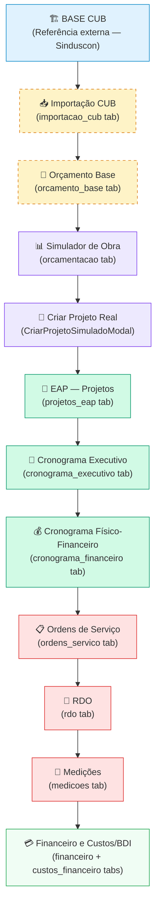

# Cadeia de Processos Works Manager: CUB ao Financeiro

**Data**: 2026-08-20
**Domínio**: `Orçamentação / Planejamento / Execução`

## Visão Geral da Cadeia

Este documento mapeia a cadeia de processo do sistema, garantindo que qualquer agente de IA compreenda o fluxo lógico desde a base de dados externa (CUB) até a execução e controle financeiro da obra, com os respectivos requisitos funcionais por etapa.

> 🟡 Tracejado = Arquitetura aprovada a ser implementada
> 🟢/🔴 Cores Sólidas = Existente e operacional

## Regras de Handoff (Integração)

O ponto crítico de handoff arquitetural do sistema é a passagem de **D (Simulador)** para **E (Criar Projeto)**.
1. O Simulador reparte o `Valor Global` (advindo do Orçamento Base CUB) em **12 Macro-Etapas construtivas**.
2. Ao aprovar no simulador, o backend (`POST /api/projetos/from-simulacao`) **planta automaticamente o código raiz na EAP** do novo projeto.
3. Além da raiz, as 12 etapas são geradas como **nós analíticos** com os valores parciais do simulador já embutidos no campo `valor_total_contratado`.
4. Isso garante a espinha dorsal de planejamento, que será herdada no Cronograma, nas O.S. e Medições.

## Capacitação do Modelo de Testes

Os testes E2E e de integração devem validar as costuras deste processo:
- **Testes de Importação CUB**: Verificar formato de dados e UF corretos (Mocking da API Sinduscon).
- **Testes de Orçamento**: Afirmar a exatidão matemática: `Área * Valor do M2 CUB = Valor Global`.
- **Testes de Handoff**: `POST /api/projetos/from-simulacao` DEVE retornar código de projeto (`P-01-26`) e confirmar a inserção de 13 nós EAP (1 raiz + 12 analíticos) para garantir que a O.S. terá onde registrar serviços no Módulo de Execução.
