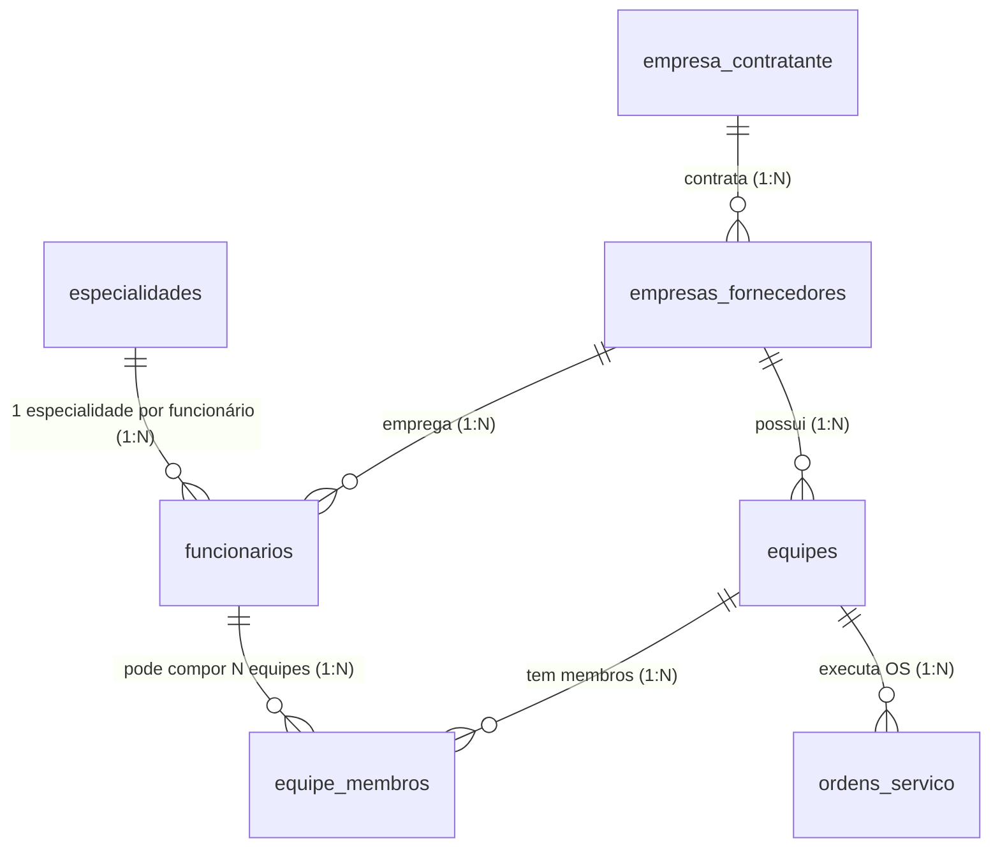

# Módulo Equipes, Funcionários & Especialidades

Plano de implementação reavaliado e ajustado:

> **Empresa Contratante (Tenant)** → **Empresas Fornecedoras** → **Equipes / Funcionários (Relacionamento N:N)** → **Especialidade (1 por Funcionário)** → **Ordens de Serviço**

---

## Modelo de Dados & Relacionamento N:N (Múltiplas Equipes por Funcionário)



---

## Regras de Negócio Reavaliadas

1. **Especialidade por Funcionário (1:1):** Cada funcionário possui **uma especialidade principal** cadastrada (ex: Eletricista, Encanador, Coordenador de Campo, Pedreiro, Técnico de Segurança).
2. **Multi-Alocação de Funcionários em Equipes (Relacionamento N:N):**
   - Um funcionário **pode compor 1 ou mais Equipes** simultaneamente da mesma Empresa Fornecedora.
   - **Exemplo de uso:** Um *Coordenador* pode coordenar a Equipe A (Civil) e a Equipe B (Instalações). Um *Eletricista* volante pode compor a Equipe de Infraestrutura e a Equipe de Montagem devido ao volume/demanda das Ordens de Serviço.
3. **Função Específica na Equipe:** Na alocação (`equipe_membros`), é definida a função daquele funcionário *dentro daquela equipe específica* (`LIDER`, `COORDENADOR`, `MEMBRO`, `SUPORTE_TECNICO`, `AUXILIAR`).
4. **Isolamento por Empresa Fornecedora:** Tanto as Equipes quanto os Funcionários pertencem a uma Empresa Fornecedora (`empresa_id`). Ao compor uma equipe, o sistema permite selecionar qualquer funcionário cadastrado naquela Empresa Fornecedora.

---

## Proposed Changes

### Banco de Dados (PostgreSQL / Supabase Migrations)

#### [NEW] [20260816100000_schema_funcionarios_equipes.sql](file:///mnt/46F84CA3F84C935B/Atividades_2026/Natan/Sistema/gestor-de-obras/supabase/migrations/20260816100000_schema_funcionarios_equipes.sql)

**Tabela 1: `especialidades`** — Catálogo de classificação da mão de obra
```sql
CREATE TABLE IF NOT EXISTS especialidades (
    id UUID PRIMARY KEY DEFAULT gen_random_uuid(),
    tenant_id VARCHAR(50) NOT NULL REFERENCES empresa_contratante(contrato_id) ON DELETE CASCADE,
    nome TEXT NOT NULL,
    descricao TEXT,
    cor TEXT DEFAULT '#005daa',
    icone TEXT DEFAULT 'engineering',
    status TEXT CHECK (status IN ('ATIVO', 'INATIVO')) DEFAULT 'ATIVO',
    created_at TIMESTAMPTZ DEFAULT NOW(),
    updated_at TIMESTAMPTZ DEFAULT NOW(),
    CONSTRAINT especialidades_nome_unico UNIQUE(tenant_id, nome)
);
```

**Tabela 2: `funcionarios`** — Funcionários da Empresa Fornecedora (1 especialidade por funcionário)
```sql
CREATE TABLE IF NOT EXISTS funcionarios (
    id UUID PRIMARY KEY DEFAULT gen_random_uuid(),
    tenant_id VARCHAR(50) NOT NULL REFERENCES empresa_contratante(contrato_id) ON DELETE CASCADE,
    empresa_id TEXT NOT NULL,
    contrato_id TEXT NOT NULL,
    nome TEXT NOT NULL,
    cpf VARCHAR(14),
    cargo TEXT,
    telefone VARCHAR(20),
    email TEXT,
    especialidade_id UUID REFERENCES especialidades(id) ON DELETE SET NULL, -- 1 Especialidade
    data_admissao DATE,
    status TEXT CHECK (status IN ('ATIVO', 'INATIVO', 'AFASTADO')) DEFAULT 'ATIVO',
    foto_url TEXT,
    created_at TIMESTAMPTZ DEFAULT NOW(),
    updated_at TIMESTAMPTZ DEFAULT NOW(),
    CONSTRAINT fk_func_empresa 
        FOREIGN KEY (empresa_id, contrato_id) 
        REFERENCES empresas_fornecedores(id, contrato_id) ON DELETE CASCADE,
    CONSTRAINT funcionarios_cpf_unico UNIQUE(tenant_id, cpf)
);
```

**Tabela 3: `equipes`** — Equipes operacionais da Empresa Fornecedora
```sql
CREATE TABLE IF NOT EXISTS equipes (
    id UUID PRIMARY KEY DEFAULT gen_random_uuid(),
    tenant_id VARCHAR(50) NOT NULL REFERENCES empresa_contratante(contrato_id) ON DELETE CASCADE,
    empresa_id TEXT NOT NULL,
    contrato_id TEXT NOT NULL,
    nome TEXT NOT NULL,
    descricao TEXT,
    lider_id UUID REFERENCES funcionarios(id) ON DELETE SET NULL,
    status TEXT CHECK (status IN ('ATIVA', 'INATIVA', 'EM_CAMPO')) DEFAULT 'ATIVA',
    created_at TIMESTAMPTZ DEFAULT NOW(),
    updated_at TIMESTAMPTZ DEFAULT NOW(),
    CONSTRAINT fk_equipe_empresa 
        FOREIGN KEY (empresa_id, contrato_id) 
        REFERENCES empresas_fornecedores(id, contrato_id) ON DELETE CASCADE,
    CONSTRAINT equipes_nome_empresa_unico UNIQUE(tenant_id, empresa_id, nome)
);
```

**Tabela 4: `equipe_membros`** — Alocação N:N (Permite 1 funcionário em Múltiplas Equipes)
```sql
CREATE TABLE IF NOT EXISTS equipe_membros (
    id UUID PRIMARY KEY DEFAULT gen_random_uuid(),
    equipe_id UUID NOT NULL REFERENCES equipes(id) ON DELETE CASCADE,
    funcionario_id UUID NOT NULL REFERENCES funcionarios(id) ON DELETE CASCADE,
    funcao_na_equipe TEXT CHECK (funcao_na_equipe IN ('LIDER', 'COORDENADOR', 'MEMBRO', 'SUPORTE_TECNICO', 'AUXILIAR')) DEFAULT 'MEMBRO',
    adicionado_em TIMESTAMPTZ DEFAULT NOW(),
    CONSTRAINT equipe_membro_unico UNIQUE(equipe_id, funcionario_id)
);
```

**Alteração na tabela `ordens_servico`:**
```sql
ALTER TABLE ordens_servico
ADD COLUMN IF NOT EXISTS equipe_id UUID REFERENCES equipes(id) ON DELETE SET NULL;
```

---

### Backend (server.ts)

#### [MODIFY] [server.ts](file:///mnt/46F84CA3F84C935B/Atividades_2026/Natan/Sistema/gestor-de-obras/server.ts)

Endpoints REST estruturados:

| Método | Rota | Descrição |
|--------|------|-----------|
| `GET` | `/api/especialidades` | Catálogo de especialidades |
| `POST` | `/api/especialidades` | Cadastrar/atualizar especialidade |
| `DELETE` | `/api/especialidades` | Remover especialidade |
| `GET` | `/api/funcionarios` | Listar funcionários (traz sua especialidade + lista das equipes que ele compõe) |
| `POST` | `/api/funcionarios` | Cadastrar/atualizar funcionário com sua especialidade |
| `DELETE` | `/api/funcionarios` | Remover funcionário |
| `GET` | `/api/equipes` | Listar equipes da fornecedora (traz membros, líder e suas especialidades) |
| `POST` | `/api/equipes` | Cadastrar/atualizar equipe e gerenciar membros (suporta inclusão de funcionários já presentes em outras equipes) |
| `DELETE` | `/api/equipes` | Remover equipe |

---

### Frontend (React Components)

#### [NEW] [FuncionariosView.tsx](file:///mnt/46F84CA3F84C935B/Atividades_2026/Natan/Sistema/gestor-de-obras/src/components/FuncionariosView.tsx)
- **Aba 1: Especialidades** — Cadastro do catálogo de especialidades.
- **Aba 2: Funcionários** — Cadastro de funcionários (1 especialidade por funcionário). Na tabela e no modal de detalhes, exibe visualmente em quais **Equipes** o funcionário está alocado no momento (ex: *Equipe Alfa (Líder)*, *Equipe Beta (Coordenador)*).

#### [NEW] [EquipesView.tsx](file:///mnt/46F84CA3F84C935B/Atividades_2026/Natan/Sistema/gestor-de-obras/src/components/EquipesView.tsx)
- Seleção da Empresa Fornecedora.
- Montagem da Equipe: permite selecionar qualquer funcionário da fornecedora (mesmo que já pertença a outra equipe).
- Exibe o indicador/badge de especialidade de cada membro e sua função naquela equipe (`LIDER`, `COORDENADOR`, `MEMBRO`, etc.).

#### [MODIFY] [OSView.tsx](file:///mnt/46F84CA3F84C935B/Atividades_2026/Natan/Sistema/gestor-de-obras/src/components/OSView.tsx)
- Atribuição de Equipe responsável à Ordem de Serviço emitida.

---

## Verification Plan

### Automated Tests
```bash
# 1. Aplicar migrações no banco local
~/.local/bin/supabase db reset

# 2. Verificar estrutura das tabelas
~/.local/bin/supabase db query "SELECT tablename FROM pg_tables WHERE schemaname = 'public' AND tablename IN ('especialidades', 'funcionarios', 'equipes', 'equipe_membros');"

# 3. Testar endpoints
curl -X GET http://localhost:8500/api/especialidades -H "Authorization: Bearer <TOKEN>"
curl -X GET http://localhost:8500/api/funcionarios -H "Authorization: Bearer <TOKEN>"
curl -X GET http://localhost:8500/api/equipes -H "Authorization: Bearer <TOKEN>"
```

### Manual Verification
- Cadastrar 1 Especialidade "Coordenador de Campo" e 1 "Eletricista".
- Cadastrar Funcionário "Carlos" (Especialidade: Coordenador de Campo) na Empresa Fornecedora X.
- Criar "Equipe 1 - Elétrica" e adicionar Carlos como `COORDENADOR`.
- Criar "Equipe 2 - Infraestrutura" e adicionar o **mesmo** Carlos também como `COORDENADOR`.
- Confirmar que a alocação N:N funciona perfeitamente nas duas equipes.
