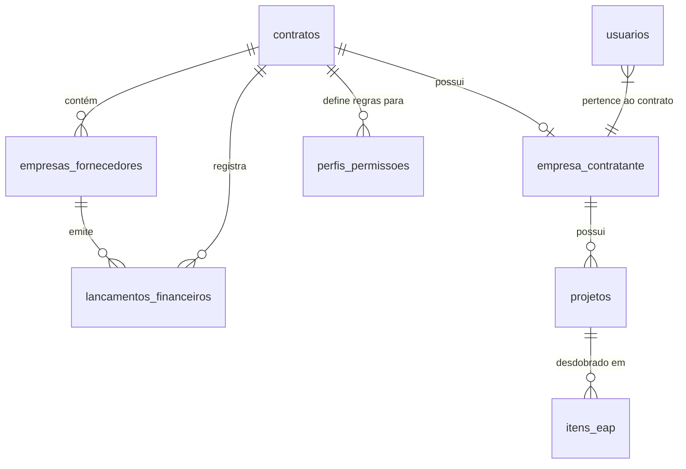

# Especificação Completa do Sistema - Works Manager (Gestor de Obras)

Este documento consolida a especificação técnica e funcional completa da plataforma **Works Manager** (anteriormente Gestor de Obras) na revisão atual. A plataforma é uma solução SaaS Multi-Tenant focada na gestão integrada de obras, infraestrutura, fornecedores, faturamentos (DRE) e contratos viários.

---

## 1. Arquitetura do Sistema e Estratégia SaaS Multi-Tenant

O sistema adota um modelo descentralizado de responsabilidades entre um **Container de Identidade (IdP)** e um **Sistema de Negócio Proprietário (Cerne)**.

### 1.1. Camada de Autenticação (AuthN) & Whitelist de Usuários
- **Provedor de Identidade (IdP - Firebase Auth)**: Responsável exclusivamente por autenticar a identidade do usuário (e-mail/senha, OAuth SSO da Google/Microsoft e Duplo Fator de Autenticação - MFA).
- **Validação Estrita via Whitelist (`usuarios` Supabase)**: Ao realizar o login no endpoint `/api/auth/oauth-login`, o backend consulta a tabela `usuarios` no PostgreSQL/Supabase pelo e-mail autenticado.
  - Usuários que **não** possuem cadastro prévio no banco recebem resposta HTTP 403 Forbidden ("Usuário não autorizado").
  - Para usuários válidos e ativos, o backend sincroniza o `uid` e a `foto_url` obtidos do provedor OAuth.
- **Custom Claims & Sessão**: O backend injeta as claims essenciais no token de sessão:
  - `uid`: Identificador único da conta.
  - `contrato_id`: Identificador do tenant contratante principal (ex: `CTR-2026-SYS`).
  - `empresa_id` / `entidade_id`: Vínculo a uma empresa/fornecedor (ex: `SUP-9823-STORAGE`).
  - `perfil`: Papel de navegação e permissão (`ADMIN`, `GESTOR`, `FINANCEIRO`, `FORNECEDOR`).
  - `mfa_verified`: Flag indicando validação de duplo fator.

### 1.2. Camada de Autorização (AuthZ & Supabase JWT Assinado)
- **Base Proprietária (PostgreSQL / Supabase)**: Assume 100% da responsabilidade sobre regras de negócio e autorização de operações CRUD.
- **Cliente Escopado por JWT Handoff (`supabase.auth.setSession`)**: O backend Express utiliza a biblioteca `jsonwebtoken` para assinar um JWT contendo as claims de negócio usando o segredo `SUPABASE_JWT_SECRET`. Este token é devolvido ao frontend após o sucesso do Firebase OAuth e injetado diretamente no Cliente Supabase via `supabase.auth.setSession()`. A partir desse momento, a gestão do usuário e a autorização ficam por conta do Supabase. Cada requisição no frontend passa a enviar automaticamente este JWT válido para RLS.
- **Segurança de Acesso (Row-Level Security - RLS Nativo)**: O isolamento multitenant de dados é forçado nativamente pelo PostgreSQL via RLS:
  - Leituras (SELECT) validam se `contrato_id = (current_setting('request.jwt.claims', true)::jsonb ->> 'contrato_id')`.
  - Mutações (INSERT, UPDATE, DELETE) validam adicionalmente se `(current_setting('request.jwt.claims', true)::jsonb ->> 'perfil') = 'ADMIN'`.
- **Zero Trust**: Nenhuma informação de identificação (como `contrato_id` ou `empresa_id`) extraída do body ou query string autoriza operações de escrita/leitura.

---

## 2. Fluxo de Autenticação e Perfis de Usuários

O sistema possui uma matriz granular de controle de acesso (RBAC) definida localmente na tabela `perfis_permissoes` do PostgreSQL, mapeada com base no papel (`perfil`) atribuído ao usuário na tabela `usuarios`.

### 2.1. Administrador Principal
- **E-mail do Administrador**: `sagacitas.sistemas@gmail.com`
- **Perfil**: `ADMIN` associado ao tenant `CTR-2026-SYS`. Possui privilégios totais de leitura e mutação via RLS nas tabelas do sistema.

### 2.2. Classificação de Perfis (Roles)
- **ADMIN**: Acesso completo e irrestrito a configurações fiscais, cadastro e edição de fornecedores, parametrização de contratos e matriz de permissões.
- **FINANCEIRO**: Permissão de leitura do DRE, faturamentos, processamento de notas fiscais e escrita/liquidação de lançamentos, sem autorização para modificação estrutural de fornecedores.
- **GESTOR**: Acompanhamento físico-financeiro de trechos viários, visualização do DRE consolidado e aprovação de medições contratuais.
- **FORNECEDOR**: Acesso limitado exclusivamente aos dados do seu próprio `empresa_id` (filtro estrito), visualizando apenas suas medições, alertas e notas sob faturamento.

---

## 3. Estrutura do Banco de Dados

A infraestrutura e o negócio são divididos entre o Firestore (dados de onboarding e invites globais) e o PostgreSQL (negócio transacional e controle de acessos).

### 3.1. Dicionário de Tabelas / Coleções

#### Tabela `usuarios` (PostgreSQL / Supabase)
Cadastro central de usuários autorizados e atribuição de papéis no tenant.
- `id` (UUID, PK): Identificador primário do registro.
- `uid` (VARCHAR): ID único vindo do Firebase Auth / OAuth SSO.
- `email` (VARCHAR, UNIQUE): E-mail do usuário utilizado para autorização via whitelist.
- `nome` (VARCHAR): Nome completo do usuário.
- `contrato_id` (VARCHAR): Código do tenant do usuário (`CTR-2026-SYS`).
- `perfil` (VARCHAR): Papel no sistema (`ADMIN`, `GESTOR`, `FINANCEIRO`, `FORNECEDOR`).
- `status` (VARCHAR): Estado da conta (`ATIVO`, `BLOQUEADO`, `INATIVO`).
- `foto_url` (VARCHAR): URL da foto de perfil importada via SSO OAuth.

#### Tabela `empresa_contratante` (PostgreSQL / Supabase)
Cadastro das entidades contratantes detentoras do tenant principal.
- `contrato_id` (VARCHAR, PK): Token/código de identificação do contrato master do tenant.
- `nome` (VARCHAR): Razão social ou nome da contratante.
- `natureza` (VARCHAR): Natureza da entidade ('Publica' ou 'Privada').
- `cnpj` (VARCHAR): Cadastro Nacional de Pessoa Jurídica da contratante.
- `email` / `telefone` (VARCHAR): Contatos institucionais.
- `gestorresponsavel` (VARCHAR): Nome do responsável principal pelo contrato.
- `unidadeadministrativa` (VARCHAR): Divisão administrativa correspondente.

#### Tabela `empresas_fornecedores` (PostgreSQL / Supabase)
Empresas homologadas, fornecedores ou subempreiteiras do ecossistema.
- `id` (VARCHAR, PK): Identificador único da empresa fornecedora.
- `contrato_id` (VARCHAR, PK, FK -> `empresa_contratante.contrato_id`): Isolamento multitenant.
- `nome` (VARCHAR): Nome empresarial ou fantasia.
- `cnpj_cpf` (VARCHAR): CNPJ ou CPF do fornecedor.
- `tipo` (VARCHAR): Categoria da empresa (`FORNECEDOR`, `CLIENTE`, `PARCEIRO`, `CONTRATANTE`).
- `email_contato` / `telefone` (VARCHAR): Dados do ponto de contato do fornecedor.
- `status` (VARCHAR): Estado de homologação (`ATIVO`, `BLOQUEADO`, `EM_ANALISE`).
- `total_faturado` (NUMERIC): Valor monetário acumulado em medições aprovadas.
- `created_at` (TEXT/TIMESTAMP): Data de cadastro do fornecedor.

#### Tabela `lancamentos_financeiros` (PostgreSQL / Supabase)
Controle transacional de receitas e despesas vinculadas a contratos de obras.
- `id` (VARCHAR, PK): ID único do lançamento.
- `contrato_id` (VARCHAR, FK): Associação ao tenant.
- `fornecedor_id` (VARCHAR, FK): Associação à empresa emitente.
- `descricao` (VARCHAR): Histórico ou descrição do faturamento.
- `valor` (NUMERIC): Valor do lançamento.
- `tipo` (VARCHAR): Tipo do faturamento (`RECEITA`, `DESPESA`).
- `status` (VARCHAR): Estado do faturamento (`PAGO`, `PENDENTE`, `EM_PROCESSAMENTO`).
- `data_vencimento` (DATE): Data limite de pagamento.
- `criado_por` (VARCHAR): E-mail do operador que efetuou a entrada.

#### Tabela `perfis_permissoes` (PostgreSQL / Supabase)
Matriz relacional de autorização granular.
- `contrato_id` (VARCHAR, PK): Tenant aplicável.
- `perfil` (VARCHAR, PK): Papel associado (`ADMIN`, `GESTOR`, `FINANCEIRO`, `FORNECEDOR`).
- `pode_ver_dre` (BOOLEAN): Acesso ao painel financeiro consolidado.
- `pode_editar_pagamento` (BOOLEAN): Habilidade de cadastrar ou liquidar parcelas.
- `pode_aprovar_medicao` (BOOLEAN): Permissão para aceitar boletins de trechos concluídos.
- `pode_cadastrar_empresa` (BOOLEAN): Homologação de novos parceiros.
- `pode_exportar_relatorio` (BOOLEAN): Acesso para downloads de DRE/Faturamento.
- `pode_gerenciar_usuarios` (BOOLEAN): Gestão de acessos locais de operadores.

#### Tabela `projetos` (PostgreSQL / Supabase)
Cadastro dos Projetos/Obras vinculados ao Contrato (Tenant).
- `id` (UUID, PK): ID único do projeto.
- `contrato_id` (VARCHAR, FK): Associação ao tenant/empresa contratante.
- `nome_projeto` (VARCHAR): Nome ou título da obra/projeto.
- `data_inicio` (DATE): Data de início da execução.

#### Tabela `itens_eap` (PostgreSQL / Supabase)
Estrutura Analítica do Projeto, detalhando etapas, serviços e quantitativos.
- `id` (UUID, PK): ID único do item.
- `projeto_id` (UUID, FK): Associação ao projeto pai.
- `eap_codigo` (VARCHAR): Código hierárquico com máscara até 3 níveis (ex: `1.2.3`).
- `eap_pai_codigo` (VARCHAR): Código da etapa superior imediata.
- `descricao_servico` (VARCHAR): Nome da etapa ou serviço.
- `e_analitico` (BOOLEAN): Flag que determina se é um serviço executável ou apenas uma etapa sintética agrupadora.
- `unidade_medida`, `preco_unitario`, `quantidade_contratada`: Detalhes financeiros (apenas para analíticos).

---

## 4. Módulos Funcionais e Telas Principais

### 4.1. Dashboard Principal
Exibição gráfica e intuitiva sobre o andamento dos projetos e faturamentos. Apresenta o pipeline de contratos ativos, alertas urgentes de prazos, totalizadores de receitas/despesas gerais e listagem das últimas atividades ocorridas no tenant.

### 4.2. DRE Financeiro (`FinanceiroView`)
Módulo de acompanhamento contábil estruturado em contas de resultado (Receita Operacional Bruta, Deduções, Custos Variáveis, EBITDA, Margens e Lucro Líquido). Integra geração de insights automáticos via **Gemini AI** (`gemini-2.5-flash`) calibrando sugestões de margens e negociações com fornecedores.

### 4.3. Cronograma Viário (`CronogramaFluxoTimeline`)
Linha do tempo interativa e física-financeira de trechos viários e obras em andamento. Detalha cronograma planejado versus executado, marcos de conclusão de trechos físico-geográficos e desembolsos previstos indexados por fornecedor.

### 4.4. Homologação de Empresas (`EmpresasView`)
Central de controle B2B para homologação, checagem cadastral, e auditoria documental de fornecedores e parceiros da cadeia produtiva. Integração nativa com RLS para restrição de cadastros a perfis `ADMIN`. Realiza operações Inline.

### 4.5. Gestão de Projetos e EAP (`ProjetosEapView`)
Módulo dedicado à estruturação de obras. Na barra lateral (sidebar), são gerenciados os Projetos de forma hierárquica. Na área central, são incluídos os Itens da Estrutura Analítica do Projeto (EAP). Implementa formatação estrita `x.x.x` (até 3 níveis) para os códigos, com cálculo automático de valores totais (Preço x Quantidade) e relacionamento de etapas sintéticas com serviços analíticos de ponta.

### 4.6. Matriz de Acessos (`MatrizAcessosView`)
Painel interativo que renderiza a matriz `perfis_permissoes` do banco PostgreSQL do tenant, permitindo a usuários `ADMIN` customizar as flags de autorização RBAC aplicadas a cada classe de perfil diretamente na UI.

