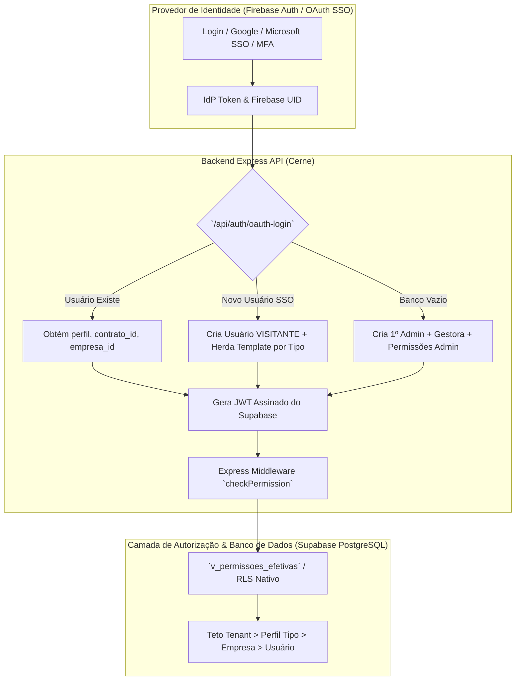
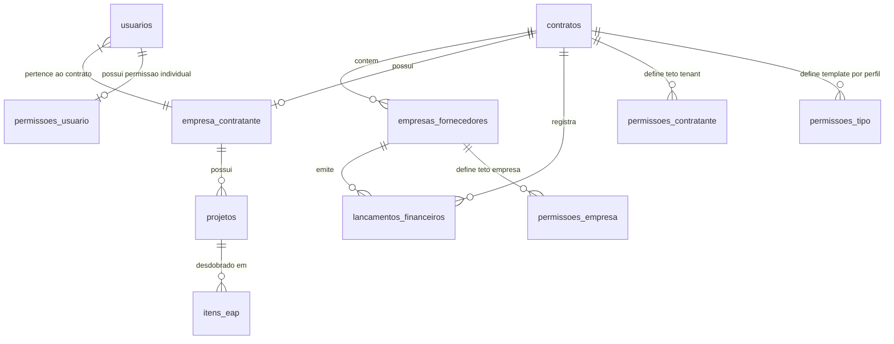

# Especificação Completa do Sistema - Works Manager (Gestor de Obras)

Este documento consolida a especificação técnica e funcional completa da plataforma **Works Manager** (anteriormente Gestor de Obras) na revisão atual. A plataforma é uma solução SaaS Multi-Tenant focada na gestão integrada de obras, infraestrutura, fornecedores, faturamentos (DRE), projetos (EAP) e contratos viários.

---

## 1. Arquitetura do Sistema e Estratégia SaaS Multi-Tenant

O sistema adota um modelo descentralizado de responsabilidades entre um **Container de Identidade (IdP)** e um **Sistema de Negócio Proprietário (Cerne)**.



### 1.1. Camada de Autenticação (AuthN) & Auto-Registro de Usuários
- **Provedor de Identidade (IdP - Firebase Auth)**: Responsável exclusivamente por autenticar a identidade do usuário (e-mail/senha, OAuth SSO da Google/Microsoft e Duplo Fator de Autenticação - MFA).
- **Lógica de Entrada e Cadastro Único**:
  - **Inicialização Limpa (Primeiro Admin)**: Se a base de dados estiver completamente vazia, o primeiro usuário autenticado via OAuth SSO (ex: Google/Microsoft) é automaticamente cadastrado como **`ADMIN`** do tenant principal `CTR-2026-SYS`, criando simultaneamente a empresa gestora `GER-2026-SYS` e injetando as permissões administrativas.
  - **Auto-Registro de Visitantes (OAuth SSO)**: Usuários que efetuarem login via SSO e ainda não possuírem cadastro prévio no sistema são registrados automaticamente com o perfil **`VISITANTE`** no tenant `CTR-2026-SYS` (empresa `SEM-EMPRESA`, status `ATIVO`).
  - **Auto-Herança de Permissões no Cadastro**: Sempre que um novo usuário é criado (seja via `/api/auth/oauth-login` ou pela rota `/api/usuarios`), o backend consulta a tabela `permissoes_tipo` referente ao perfil selecionado (ex: `VISITANTE`, `FORNECEDOR`, `GESTOR`) e copia automaticamente o template de permissões para a tabela `permissoes_usuario` vinculada ao `usuario_uid`. Isso assegura que o usuário receba suas permissões de forma automática no momento do cadastro, permitindo edições posteriores específicas para aquele usuário.
- **Custom Claims & Sessão**: O backend injeta as claims essenciais no token de sessão:
  - `uid`: Identificador único da conta.
  - `contrato_id`: Identificador do tenant contratante principal (ex: `CTR-2026-SYS`).
  - `empresa_id` / `entidade_id`: Vínculo a uma empresa/fornecedor (ex: `GER-2026-SYS` ou `SUP-9823-STORAGE`).
  - `perfil`: Papel do usuário (`ADMIN`, `GESTOR`, `FINANCEIRO`, `FORNECEDOR`, `VISITANTE`).
  - `mfa_verified`: Flag indicando validação de duplo fator.
- **Sincronismo Firebase ↔ Supabase (`claims_pendentes`)**: Toda edição de usuário no backend ativa a flag `claims_pendentes = true` na tabela `usuarios`. No próximo login ou renovação da sessão, a rotina `ensureUserExists` identifica a flag, força a recarga das custom claims atualizadas diretamente no Firebase Admin SDK e desliga a flag, garantindo sincronismo bidirecional seguro (contornando restrições do Vercel sem acesso local a credenciais do Firebase). Há também um endpoint manual (`POST /api/auth/sync-claims`) acionado por um botão na UI para forçar esse sincronismo sob demanda.

### 1.2. Camada de Autorização (AuthZ & Supabase JWT Handoff)
- **Base Proprietária (PostgreSQL / Supabase)**: Assume 100% da responsabilidade sobre regras de negócio e autorização de operações CRUD.
- **Cliente Escopado por JWT Handoff (`supabase.auth.setSession`)**: O backend Express utiliza a biblioteca `jsonwebtoken` para assinar um JWT contendo as claims de negócio usando o segredo `SUPABASE_JWT_SECRET`. Este token é devolvido ao frontend após a autenticação e injetado diretamente no Cliente Supabase via `supabase.auth.setSession()`. O Tempo de Vida (TTL) do JWT de sessão é de **4 horas** (reduzido para acelerar o sincronismo e garantir maior segurança), enquanto o ticket temporário MFA possui TTL de **10 minutos**. Esses valores de configuração são controlados globalmente via `SYSTEM_PARAMS`.
- **Segurança de Acesso (Row-Level Security - RLS Nativo)**: O isolamento multitenant de dados é forçado nativamente pelo PostgreSQL via RLS:
  - Leituras (`SELECT`) validam se `contrato_id = (current_setting('request.jwt.claims', true)::jsonb ->> 'contrato_id')`.
  - Mutações (`INSERT`, `UPDATE`, `DELETE`) validam adicionalmente o perfil ou as permissões efetivas computadas.

---

## 2. Modelo de Delegação Hierárquica de Permissões (Matriz de Acessos)

O sistema implementa uma estrutura de **Delegação Hierárquica em 4 Níveis (Cascade Ceiling)** para o cálculo das permissões efetivas do usuário:

```
[1. Teto Global do Tenant (permissoes_contratante)]
                   │
                   ▼
  [2. Template por Tipo (permissoes_tipo)]
                   │
                   ▼
  [3. Teto por Empresa (permissoes_empresa)]
                   │
                   ▼
  [4. Permissão por Usuário (permissoes_usuario)]
                   │
                   ▼
  [RESULTADO: View v_permissoes_efetivas]
```

### 2.1. Níveis de Permissão e Regras de Precedência

1. **Nível 1 - Tenant (Contratante)**: Define o teto máximo de permissões que qualquer empresa ou usuário pertencente ao contrato (`contrato_id`) pode possuir. Configurável exclusivamente por usuários `ADMIN`.
2. **Nível 2 - Por Tipo (Perfil Template)**: Configuração padrão herdada automaticamente por perfis (`ADMIN`, `GESTOR`, `FINANCEIRO`, `FORNECEDOR`, `VISITANTE`). Utilizada como semente no momento do cadastro do usuário.
3. **Nível 3 - Por Empresa (Empresa Fornecedora/Parceira)**: Define o limite (teto) de ações permitidas para os usuários associados a um `empresa_id` específico. Não pode ultrapassar o Teto Global do Tenant.
4. **Nível 4 - Por Usuário (Permissão Efetiva Individual)**: Configuração individual vinculada diretamente ao `usuario_uid`. É herdada do template por tipo na criação e pode ser customizada pontualmente. É limitada pelo teto da sua empresa (se houver) ou pelo teto global.

### 2.2. Cálculo de Permissões Computadas (`getComputedPermissions`)

No backend Express, a função `getComputedPermissions(req)` avalia as permissões na seguinte ordem de prioridade:
1. **ADMIN Bypass**: Usuários com `perfil === 'ADMIN'` recebem todas as permissões (`true`) automaticamente.
2. **Consulta à View `v_permissoes_efetivas`**: O backend executa a query na view PostgreSQL que unifica e aplica a interseção booleana (AND lógico) entre o teto do tenant, teto da empresa e permissões do usuário.
3. **Fallback `permissoes_tipo`**: Caso o usuário ainda não possua registro em `v_permissoes_efetivas`, o sistema lê as regras de `permissoes_tipo` para o seu perfil.
4. **Fallback de Segurança Padrão**: Se nenhum registro for encontrado, aplica-se permissão de leitura às rotas básicas e negação total (`false`) para operações de mutação (`criar`, `editar`, `excluir`).

### 2.3. Mapeamento de Chaves de Permissão

As permissões do sistema são divididas pelos módulos fundamentais:

| Módulo | Chaves de Permissão Disponíveis |
| :--- | :--- |
| **Empresas** | `empresas_criar`, `empresas_ler`, `empresas_editar`, `empresas_excluir` |
| **Projetos (EAP)** | `projetos_criar`, `projetos_ler`, `projetos_editar`, `projetos_excluir` |
| **Medições & Contratos** | `medicoes_criar`, `medicoes_ler`, `medicoes_editar`, `medicoes_excluir` |
| **Financeiro & Lançamentos**| `financeiro_criar`, `financeiro_ler`, `financeiro_editar`, `financeiro_excluir` |
| **Relatórios** | `relatorios_ler` |
| **Usuários & Acessos** | `usuarios_criar`, `usuarios_ler`, `usuarios_editar`, `usuarios_excluir` |

### 2.4. Enforcing / Middleware de Proteção no Backend e Frontend

- **Backend Express (`checkPermission(req, key)`)**:
  - Middleware injetado em todas as rotas sensíveis (`/api/empresas`, `/api/projetos`, `/api/usuarios`, `/api/firestore/lancamentos`, `/api/contratos-obra`, etc.).
  - Retorna **HTTP 403 Forbidden** com mensagem de erro amigável caso a chave de permissão requerida seja `false`.
- **Frontend App Guard (`effectivePermissions` & `Sidebar.tsx`)**:
  - Logo após o login, o frontend busca `/api/permissoes/efetivas/:uid` e armazena o objeto de permissões no estado `effectivePermissions` do `App.tsx`.
  - A `Sidebar.tsx` renderiza dinamicamente os itens de menu com base na função `hasAccess(tab)` (ex: só exibe o menu "Empresas" se `effectivePermissions.empresas_ler` for verdadeiro).
  - Tentativas de acesso direto por troca de estado são bloqueadas no `App.tsx`, exibindo a tela de aviso **"Acesso Restrito: Sem permissão"**.

---

## 3. Estrutura do Banco de Dados

A infraestrutura é organizada entre o Firestore (dados de onboarding e invites) e o PostgreSQL/Supabase (transacional, multitenant e permissões).



### 3.1. Dicionário de Tabelas de Permissões e Acessos

#### Tabela `usuarios` (PostgreSQL / Supabase)
Cadastro central de usuários autorizados e atribuição de papéis no tenant.
- `id` (UUID, PK): Identificador primário.
- `uid` (VARCHAR, UNIQUE): ID vindo do Firebase Auth / OAuth SSO.
- `email` (VARCHAR, UNIQUE): E-mail do usuário.
- `nome` (VARCHAR): Nome completo.
- `contrato_id` (VARCHAR): Código do tenant (`CTR-2026-SYS`).
- `empresa_id` (VARCHAR, NULLABLE): Vínculo com a empresa fornecedora.
- `perfil` (VARCHAR): Papel no sistema (`ADMIN`, `GESTOR`, `FINANCEIRO`, `FORNECEDOR`, `VISITANTE`).
- `status` (VARCHAR): Estado da conta (`ATIVO`, `BLOQUEADO`, `INATIVO`).
- `foto_url` (VARCHAR): URL da imagem de perfil.
- `claims_pendentes` (BOOLEAN): Flag de sincronização que indica se as custom claims do usuário devem ser reinjetadas no Firebase Admin SDK durante o próximo login (Default: FALSE).

#### Tabela `permissoes_contratante` (Teto Global)
- `contrato_id` (VARCHAR, PK): Identificador do tenant.
- Campos booleanos: `empresas_criar`, `empresas_ler`, `empresas_editar`, `empresas_excluir`, `projetos_criar`, `projetos_ler`, `projetos_editar`, `projetos_excluir`, `medicoes_criar`, `medicoes_ler`, `medicoes_editar`, `medicoes_excluir`, `financeiro_criar`, `financeiro_ler`, `financeiro_editar`, `financeiro_excluir`, `relatorios_ler`, `usuarios_criar`, `usuarios_ler`, `usuarios_editar`, `usuarios_excluir`.

#### Tabela `permissoes_tipo` (Template por Perfil)
- `id` (UUID, PK): ID único.
- `contrato_id` (VARCHAR): Identificador do tenant.
- `perfil` (VARCHAR): Perfil associado (`ADMIN`, `GESTOR`, `FINANCEIRO`, `FORNECEDOR`, `VISITANTE`).
- Campos booleanos de permissões (mesma estrutura de módulos).

#### Tabela `permissoes_empresa` (Teto por Empresa)
- `id` (UUID, PK): ID único.
- `contrato_id` (VARCHAR): Identificador do tenant.
- `empresa_id` (VARCHAR, UNIQUE/FK): Empresa fornecedora associada.
- Campos booleanos de permissões.

#### Tabela `permissoes_usuario` (Permissão Individual)
- `id` (UUID, PK): ID único.
- `usuario_uid` (VARCHAR, UNIQUE/FK): UID do usuário.
- `contrato_id` (VARCHAR): Identificador do tenant.
- `empresa_id` (VARCHAR, NULLABLE): Empresa associada.
- Campos booleanos de permissões.

#### View `v_permissoes_efetivas` (PostgreSQL)
View calculada nativamente no banco que combina via `AND` lógico as permissões de `permissoes_usuario` com os limites de `permissoes_empresa` e `permissoes_contratante`.

---

## 4. Módulos Funcionais e Telas Principais

### 4.1. Dashboard Principal
Exibição gráfica e intuitiva sobre o andamento dos projetos e faturamentos. Apresenta o pipeline de contratos ativos, alertas urgentes de prazos, totalizadores de receitas/despesas gerais e listagem das últimas atividades ocorridas no tenant.

### 4.2. DRE Financeiro (`FinanceiroView`)
Módulo de acompanhamento contábil estruturado em contas de resultado (Receita Operacional Bruta, Deduções, Custos Variáveis, EBITDA, Margens e Lucro Líquido). Integra geração de insights automáticos via **Gemini AI** (`gemini-2.5-flash`) calibrando sugestões de margens e negociações com fornecedores.

### 4.3. Cronograma Viário (`CronogramaFluxoTimeline`)
Linha do tempo interativa e física-financeira de trechos viários e obras em andamento. Detalha cronograma planejado versus executado, marcos de conclusão de trechos físico-geográficos e desembolsos previstos indexados por fornecedor.

### 4.4. Homologação de Empresas (`EmpresasView`)
Central de controle B2B para homologação, checagem cadastral, e auditoria documental de fornecedores e parceiros da cadeia produtiva. Protegida por permissões `empresas_ler` e `empresas_criar/editar`.

### 4.5. Gestão de Projetos e EAP (`ProjetosEapView`)
Módulo dedicado à estruturação de obras. Na barra lateral (sidebar), são gerenciados os Projetos de forma hierárquica. Na área central, são incluídos os Itens da Estrutura Analítica do Projeto (EAP). Implementa formatação estrita `x.x.x` (até 3 níveis) para os códigos, com cálculo automático de valores totais e validações de escrita (`projetos_criar`/`projetos_editar`).

### 4.6. Matriz de Acessos (`MatrizAcessosView`)
Painel interativo e hierárquico organizado em **4 Abas de Configuração**:
1. **1. Tenant (Contratante)**: Configuração do Teto Global do Contrato (`CTR-2026-SYS`). Exclusivo para perfil `ADMIN`.
2. **2. Por Tipo**: Definição dos Templates padrão (`ADMIN`, `GESTOR`, `FINANCEIRO`, `FORNECEDOR`, `VISITANTE`).
3. **3. Por Empresa**: Definição dos Tetos aplicados a empresas fornecedoras cadastradas na base. Dropdown conectado à API `/api/empresas`.
4. **4. Por Usuário**: Ajuste de permissões individuais por operador. Dropdown conectado à API `/api/usuarios`.

### 4.7. Parâmetros do Sistema (`ParametrosView`)
Interface global de configuração (`/api/parametros`) acessível unicamente por Administradores (`ADMIN`), permitindo edições dinâmicas e em tempo de execução dos **`SYSTEM_PARAMS`**:
- **Autenticação**: Ajuste de tempo da Sessão JWT (ex: `4h`) e Validade do Ticket MFA (ex: `10m`).
- **Compliance / Logs**: Dias de retenção do Audit Log (registro de trilha) e do Error Log.
- **Sincronismo**: Toggle para habilitar ou desabilitar o sincronismo automatizado de claims no login. Alterações nessa tela geram eventos automáticos na auditoria do sistema.
